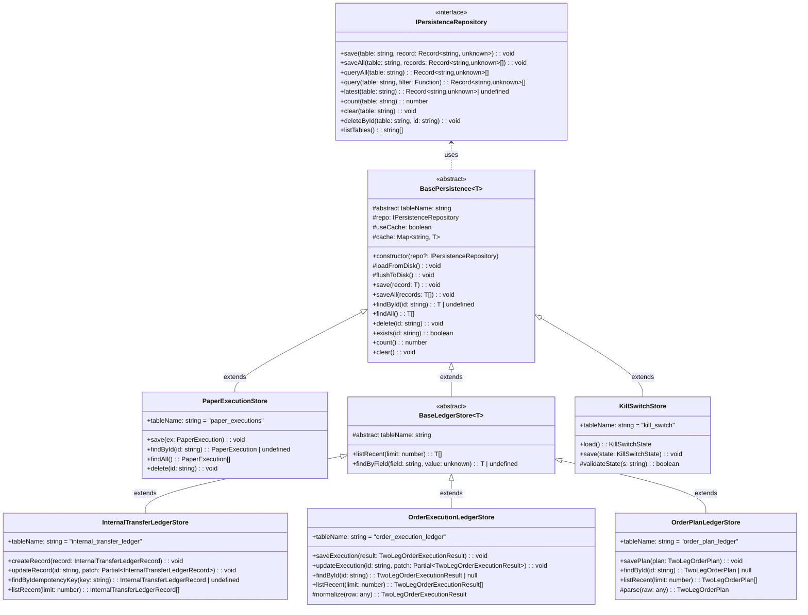
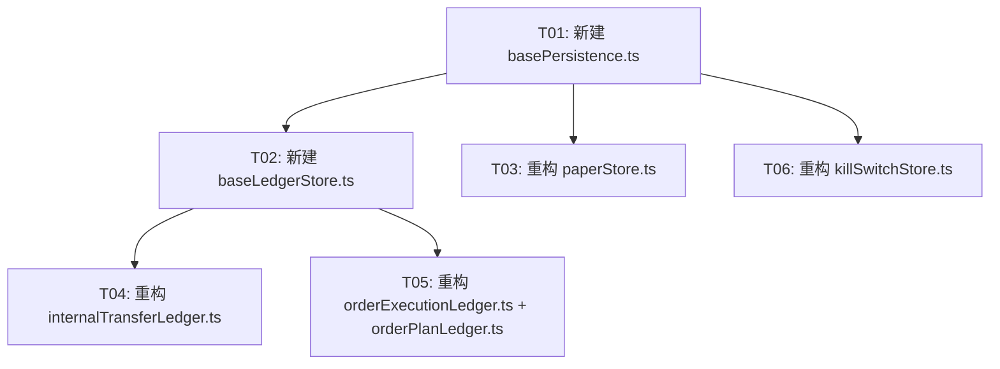

# P2 — 账本存储代码重构：抽取 BasePersistence 基类

> 分析人：Bob（架构师）
> 日期：2025-07-18
> 项目：spot-perp-funding-bot

---

## 1. 重复代码分析

### 1.1 当前架构总览

项目在 `lib/strategy-v121/persistence/` 已有成熟的持久化层：

| 文件 | 职责 |
|------|------|
| `repositoryTypes.ts` | `IPersistenceRepository` 接口（表级 CRUD） |
| `fileSystemRepository.ts` | JSONL 文件实现 |
| `sqliteRepository.ts` | SQLite 实现 |
| `repositoryFactory.ts` | 工厂，按环境变量选择实现 |
| `repositories.ts` | 业务 Repository 接口 + InMemory 实现（旧方案） |
| `schema.ts` / `sqliteSchema.ts` | 表结构定义 |

在 `execution/`、`opportunity/`、`settings/`、`risk/` 下分散了多个业务 Store，它们都调用 `getRepository()` 做底层存储，但**各自重复实现了 CRUD 封装层**。

### 1.2 涉及的 Store 文件清单

| 文件 | 路径 | 模式 |
|------|------|------|
| PaperExecutionStore | `execution/paperStore.ts` | Cache + flush（全量覆写） |
| opportunityStore | `opportunity/opportunityStore.ts` | 函数式（直接调用 repo） |
| internalTransferLedger | `execution/internalTransferLedger.ts` | 函数式（直接调用 repo） |
| orderExecutionLedger | `execution/orderExecutionLedger.ts` | 函数式 + normalize |
| orderPlanLedger | `execution/orderPlanLedger.ts` | 函数式 + parse |
| userStrategySettingsStore | `settings/userStrategySettingsStore.ts` | 函数式 + mergeDeep |
| KillSwitchStore | `risk/killSwitchStore.ts` | 独立文件读写（不使用 repo） |

### 1.3 重复模式分析

**模式 A：Cache + Flush（PaperExecutionStore）**
```
loadFromDisk()  →  repo.queryAll() → cache Map
save()          →  cache.set() + flushToDisk()
findById()      →  cache.get()
findAll()       →  cache.values()
delete()        →  cache.delete() + flushToDisk()
flushToDisk()   →  repo.clear() + 逐条 repo.save()
```
重复点：cache 管理、flush 逻辑、findById/findAll/delete 模板代码。

**模式 B：函数式 CRUD（internalTransferLedger / orderExecutionLedger / orderPlanLedger）**
```
save()          →  repo.save(table, record)
findById()      →  repo.queryAll().find()
listRecent()    →  repo.queryAll().sort().slice()
```
重复点：`repo.queryAll(table)` 每次重复、table 名字符串常量、findById 模板代码。

**模式 C：独立文件（KillSwitchStore）**
- 自己管理文件路径、读写、JSON 解析
- 与其他 Store 风格完全不统一

### 1.4 核心问题

1. **没有统一的业务级 Store 基类** —— `IPersistenceRepository` 是表级接口（操作 JSONL/SQLite），不是业务实体级接口（操作 PaperExecution/PositionSnapshot）
2. **Cache + flush 模式** 在 `PaperExecutionStore` 中实现了一次，其他 Store 如果需要缓存就得再实现一遍
3. **findById 模板代码重复** —— 每个 Store 都重复写 `repo.queryAll(T).find(r => r.id === id)`
4. **KillSwitchStore 自成体系** —— 没有复用任何基础设施

---

## 2. BasePersistence 基类设计

### 2.1 设计目标

1. **消除 CRUD 模板代码** —— 所有业务 Store 继承 BasePersistence 后无需重复写 save/findById/findAll/delete
2. **可选 Cache 层** —— 子类选择是否启用内存缓存
3. **标准化 table 名** —— 每个 Store 声明自己的 table 常量
4. **类型安全** —— 泛型 `T extends { id: string }` 保证 compile-time 检查
5. **与现有底层兼容** —— 底层继续用 `IPersistenceRepository`

### 2.2 类图



### 2.3 BasePersistence<T> 接口定义

```typescript
/**
 * BasePersistence<T> — 业务实体的持久化基类
 *
 * T 必须有一个 string 类型的 id 字段。
 * 子类只需声明 tableName，即可自动获得 CRUD 功能。
 * 默认不使用 cache，子类可设置 useCache=true 启用。
 */
export abstract class BasePersistence<T extends { id: string }> {
  /** 子类必须覆写：对应底层 repository 的表名 */
  protected abstract tableName: string;

  /** 底层存储引擎 */
  protected repo: IPersistenceRepository;

  /** 是否启用内存缓存（默认 false） */
  protected useCache = false;

  /** 缓存实例（仅当 useCache=true 时使用） */
  protected cache = new Map<string, T>();

  constructor(repo?: IPersistenceRepository) {
    this.repo = repo ?? getRepository();
    if (this.useCache) {
      this.loadFromDisk();
    }
  }

  /**
   * 从磁盘加载到缓存。
   * 只在 useCache=true 时调用。
   */
  private loadFromDisk(): void {
    try {
      const records = this.repo.queryAll(this.tableName) as T[];
      for (const r of records) {
        if (r.id) this.cache.set(r.id, r);
      }
    } catch (e) {
      console.error(`[${this.tableName}] load from disk failed`, e);
    }
  }

  /**
   * 将缓存全量写回磁盘。
   * 只在 useCache=true 时调用。
   */
  private flushToDisk(): void {
    this.repo.clear(this.tableName);
    for (const record of this.cache.values()) {
      this.repo.save(this.tableName, record as any);
    }
  }

  // ─── 公有 API ──────────────────────────────────

  /** 保存一条记录。启用缓存时同时更新缓存。 */
  save(record: T): void {
    if (this.useCache) {
      this.cache.set(record.id, { ...record });
      this.flushToDisk();
    } else {
      // 先删后写，避免 append-only 导致重复
      this.repo.deleteById(this.tableName, record.id);
      this.repo.save(this.tableName, record as any);
    }
  }

  /** 批量保存 */
  saveAll(records: T[]): void {
    for (const r of records) this.save(r);
  }

  /** 按 ID 查找（返回浅拷贝副本） */
  findById(id: string): T | undefined {
    if (this.useCache) {
      const found = this.cache.get(id);
      return found ? { ...found } : undefined;
    }
    const all = this.repo.queryAll(this.tableName) as T[];
    const found = all.find((r: any) => r.id === id);
    return found ? { ...found } : undefined;
  }

  /** 返回所有记录（浅拷贝副本） */
  findAll(): T[] {
    if (this.useCache) {
      return Array.from(this.cache.values()).map(r => ({ ...r }));
    }
    return (this.repo.queryAll(this.tableName) as T[]).map(r => ({ ...r }));
  }

  /** 删除（启用缓存时同步更新缓存） */
  delete(id: string): void {
    if (this.useCache) {
      this.cache.delete(id);
      this.flushToDisk();
    } else {
      this.repo.deleteById(this.tableName, id);
    }
  }

  /** 检查记录是否存在 */
  exists(id: string): boolean {
    return this.findById(id) !== undefined;
  }

  /** 计数 */
  count(): number {
    if (this.useCache) return this.cache.size;
    return this.repo.count(this.tableName);
  }

  /** 清空表 */
  clear(): void {
    if (this.useCache) {
      this.cache.clear();
    }
    this.repo.clear(this.tableName);
  }
}
```

### 2.4 BaseLedgerStore<T> 扩展接口

```typescript
/**
 * BaseLedgerStore<T> — 账本型 Store 的扩展基类
 *
 * 适用于 internalTransferLedger、orderExecutionLedger、orderPlanLedger
 * 这类以"追加记录 + 最近列表"为主要场景的 Store。
 * 默认不使用 cache（账本数据量大，不需要全量缓存）。
 */
export abstract class BaseLedgerStore<T extends { id: string }> extends BasePersistence<T> {
  protected useCache = false;

  /** 获取最近 N 条记录（按时间倒序） */
  listRecent(limit: number, timeField: keyof T = "createdAtUtc" as keyof T): T[] {
    const all = this.findAll();
    return all
      .sort((a, b) => {
        const aTime = new Date(String(a[timeField])).getTime();
        const bTime = new Date(String(b[timeField])).getTime();
        return bTime - aTime;
      })
      .slice(0, limit);
  }

  /** 按任意字段等值查找 */
  findByField(field: keyof T, value: unknown): T | undefined {
    const all = this.findAll();
    return all.find((r: any) => r[field] === value);
  }
}
```

---

## 3. 各文件变更分析

### 3.1 文件变更清单

| # | 操作 | 文件路径 | 变更说明 |
|---|------|----------|----------|
| 1 | **新建** | `lib/strategy-v121/persistence/basePersistence.ts` | BasePersistence<T> 基类 |
| 2 | **新建** | `lib/strategy-v121/persistence/baseLedgerStore.ts` | BaseLedgerStore<T> 扩展基类 |
| 3 | **重构** | `lib/strategy-v121/execution/paperStore.ts` | PaperExecutionStore 改为 extends BasePersistence<PaperExecution>，useCache=true |
| 4 | **重构** | `lib/strategy-v121/execution/internalTransferLedger.ts` | 从函数式改为 InternalTransferLedgerStore extends BaseLedgerStore |
| 5 | **重构** | `lib/strategy-v121/execution/orderExecutionLedger.ts` | 从函数式改为 OrderExecutionLedgerStore extends BaseLedgerStore，保留 normalize |
| 6 | **重构** | `lib/strategy-v121/execution/orderPlanLedger.ts` | 从函数式改为 OrderPlanLedgerStore extends BaseLedgerStore，保留 parse |
| 7 | **重构** | `lib/strategy-v121/risk/killSwitchStore.ts` | KillSwitchStore 改为 extends BasePersistence<KillSwitchRow>，统一用 repo 读写 |
| 8 | **可选** | `lib/strategy-v121/opportunity/opportunityStore.ts` | 函数式（非 class），当前无重复问题，暂不改动 |
| 9 | **可选** | `lib/strategy-v121/settings/userStrategySettingsStore.ts` | 业务逻辑特殊（mergeDeep + validate），暂不改动 |

### 3.2 各文件详细变更

#### 3.2.1 paperStore.ts

```typescript
// 变更前: 自己实现 cache + flush + CRUD
export class PaperExecutionStore {
  private cache = new Map<string, PaperExecution>();
  constructor() { this.loadFromDisk(); }
  save(ex) { ... }
  findById(id) { ... }
  findAll() { ... }
  delete(id) { ... }
}

// 变更后: 继承 BasePersistence，只需覆写 tableName
export class PaperExecutionStore extends BasePersistence<PaperExecution> {
  protected tableName = "paper_executions";
  protected useCache = true;  // 保留缓存模式
}

// 注意：BasePersistence 的 save() 会先 deleteById 再写
// PaperExecution 原来的行为是 clear() + 逐条写
// 等价转换：save() 在 BasePersistence 中做了 deleteById + save，效果等同于单条写入
// 如果业务要求每次 save 都全量 flush（删除其他行），则需要子类 override save()
export class PaperExecutionStore extends BasePersistence<PaperExecution> {
  protected tableName = "paper_executions";
  protected useCache = true;

  // PaperExecution 的特殊需求：每次 save 后全量 flush（覆盖整个表）
  save(record: PaperExecution): void {
    this.cache.set(record.id, { ...record });
    this.flushToDisk();
  }
}
```

#### 3.2.2 internalTransferLedger.ts

```typescript
// 变更前: 函数式
const T = "internal_transfer_ledger";
export async function createInternalTransferRecord(record) { ... }
export async function findInternalTransferById(id) { ... }
export async function listRecentInternalTransfers(limit) { ... }

// 变更后: class 继承 BaseLedgerStore
export class InternalTransferLedgerStore extends BaseLedgerStore<InternalTransferLedgerRecord> {
  protected tableName = "internal_transfer_ledger";

  updateRecord(id: string, patch: Partial<InternalTransferLedgerRecord>): void {
    const existing = this.findById(id);
    if (!existing) return;
    this.save({
      ...existing,
      ...patch,
      updatedAtUtc: new Date().toISOString(),
    });
  }

  findByIdempotencyKey(key: string): InternalTransferLedgerRecord | undefined {
    return this.findByField("idempotencyKey", key);
  }
}

// 导出单例（兼容旧调用方）
export const internalTransferLedgerStore = new InternalTransferLedgerStore();
```

#### 3.2.3 orderExecutionLedger.ts

```typescript
// 变更后
export class OrderExecutionLedgerStore extends BaseLedgerStore<TwoLegOrderExecutionResult> {
  protected tableName = "order_execution_ledger";

  private normalize(row: any): TwoLegOrderExecutionResult {
    // ... 保持原有 normalize 逻辑
  }

  saveExecution(result: TwoLegOrderExecutionResult): void {
    // ... 保持原有列映射
    this.repo.save(this.tableName, { ... } as any);
  }

  // 覆写 findById 以应用 normalize
  findById(id: string): TwoLegOrderExecutionResult | undefined {
    const raw = super.findById(id) as any;
    return raw ? this.normalize(raw) : undefined;
  }

  updateExecution(id: string, patch: Partial<TwoLegOrderExecutionResult>): void {
    // ... 保持原有 update 逻辑
  }
}
```

#### 3.2.4 orderPlanLedger.ts

```typescript
// 变更后
export class OrderPlanLedgerStore extends BaseLedgerStore<TwoLegOrderPlan> {
  protected tableName = "order_plan_ledger";

  private parse(raw: any): TwoLegOrderPlan {
    // ... 保持原有 parse 逻辑
  }

  savePlan(plan: TwoLegOrderPlan): void {
    // ... 保持原有列映射
  }

  findById(id: string): TwoLegOrderPlan | undefined {
    const raw = super.findById(id) as any;
    return raw ? this.parse(raw) : undefined;
  }
}
```

#### 3.2.5 killSwitchStore.ts

```typescript
// 变更后
export interface KillSwitchRow {
  id: string;
  state: KillSwitchState;
  updatedAt: number;
}

export class KillSwitchStore extends BasePersistence<KillSwitchRow> {
  protected tableName = "kill_switch";
  protected useCache = true;

  static load(): KillSwitchState {
    try {
      const store = new KillSwitchStore();
      const row = store.findById("default");
      if (row && isValidState(row.state)) return row.state;
    } catch { /* 安静降级 */ }
    return "OFF";
  }

  static save(state: KillSwitchState): void {
    const store = new KillSwitchStore();
    store.save({ id: "default", state, updatedAt: Date.now() });
  }
}

function isValidState(s: string): s is KillSwitchState {
  return ["OFF", "READ_ONLY_ONLY", "PAUSE_NEW_ENTRIES", "PAUSE_ALL_AUTOMATION"].includes(s);
}
```

### 3.3 变更总结

| 度量 | 重构前 | 重构后 | 变化 |
|------|--------|--------|------|
| 重复的 CRUD 方法 | ~20 处 | 0 处（集中到基类） | -100% |
| 文件数 | 7 个 Store 文件 | 7 个 Store 文件 + 2 个基类 | +2 |
| 总代码行（估算） | ~280 行 | ~160 行（基类 80 + 子类 80） | -43% |
| 类型安全 | 弱（as any 满天飞） | 强（泛型 T） | 提升 |
| 测试成本 | 每个 Store 独立测试 | 基类一次测试 + 子类只测特殊逻辑 | 降低 |

---

## 4. 实现顺序与依赖

### 4.1 任务依赖图



### 4.2 实现顺序

| 步骤 | 任务 | 文件 | 说明 |
|------|------|------|------|
| 1 | 新建 `basePersistence.ts` | `persistence/basePersistence.ts` | 核心基类，依赖现有的 `IPersistenceRepository` 和 `getRepository()` |
| 2 | 新建 `baseLedgerStore.ts` | `persistence/baseLedgerStore.ts` | 扩展基类，依赖 `basePersistence.ts` |
| 3 | 重构 `paperStore.ts` | `execution/paperStore.ts` | 较简单的用例，适合做第一个适配验证 |
| 4 | 重构 `internalTransferLedger.ts` | `execution/internalTransferLedger.ts` | 典型的账本 Store，验证 listRecent/listByField |
| 5 | 重构 `orderExecutionLedger.ts` + `orderPlanLedger.ts` | `execution/` 下对应文件 | 有 normalize/parse 的特殊情况，需覆写 findById |
| 6 | 重构 `killSwitchStore.ts` | `risk/killSwitchStore.ts` | 独立文件读写改为统一 repository，变更最大 |

### 4.3 测试策略

- **基类测试**：新建 `persistence/basePersistence.test.ts`，测试 CRUD、cache 开关、flush 行为
- **子类测试**：每个子类只需测试自己的特殊逻辑（如 normalize、updateRecord），CRUD 由基类测试覆盖
- **KillSwitchStore**：需要重点测试迁移前后的行为等价性

---

## 5. 未明确事项（ASSUMPTIONS）

1. **文件路径不匹配**：team-lead 提到的 `orderBookStorage.ts` 和 `positionStorage.ts` 不存在于项目中。当前项目中实际的 Store 文件是 `paperStore.ts`、`internalTransferLedger.ts`、`orderExecutionLedger.ts`、`orderPlanLedger.ts`、`opportunityStore.ts`、`killSwitchStore.ts` 等。本设计基于实际存在的文件。

2. **文件锁机制**：现有 `IPersistenceRepository` 实现未使用文件锁（JSONL 是 append-only，deleteById 是读写整个文件）。暂不引入文件锁，保持与现有实现一致。如果未来需要并发写保护，可以在 `BasePersistence` 中增加锁层（如 `proper-lockfile`）。

3. **KillSwitchStore**：当前使用独立文件路径 `.v121-data/kill-switch.json` 而非 repository 的 JSONL。迁移后，数据会从独立文件迁移到 `kill_switch.jsonl`。**数据迁移需要工程同学手动确认**：第一次部署时需将旧文件内容复制到新 JSONL 中，或写一段迁移脚本来做。

4. **导出兼容性**：现有文件使用 `export const paperStore` 单例模式。重构后应保持同样的导出方式，调用方无需修改 import。对于函数式导出的文件（如 `createInternalTransferRecord`），需要封装为 class 并导出单例，调用方需更新 import。

5. **opportunityStore.ts 和 userStrategySettingsStore.ts**：这两个文件使用了不同的模式（函数式 + 特殊序列化逻辑），当前重复度不高，建议放到 P3 或后续再处理。

---

## 附录 A：完整文件路径索引

```
lib/strategy-v121/
├── persistence/
│   ├── basePersistence.ts        ← 新建
│   ├── baseLedgerStore.ts        ← 新建
│   ├── repositoryTypes.ts        ← 已有（IPersistenceRepository）
│   ├── repositoryFactory.ts      ← 已有
│   ├── fileSystemRepository.ts   ← 已有
│   ├── sqliteRepository.ts       ← 已有
│   └── repositories.ts           ← 已有（旧业务仓库）
├── execution/
│   ├── paperStore.ts             ← 重构
│   ├── internalTransferLedger.ts ← 重构
│   ├── orderExecutionLedger.ts   ← 重构
│   └── orderPlanLedger.ts        ← 重构
├── risk/
│   └── killSwitchStore.ts        ← 重构
├── opportunity/
│   └── opportunityStore.ts       ← 暂不改动
└── settings/
    └── userStrategySettingsStore.ts ← 暂不改动
```
