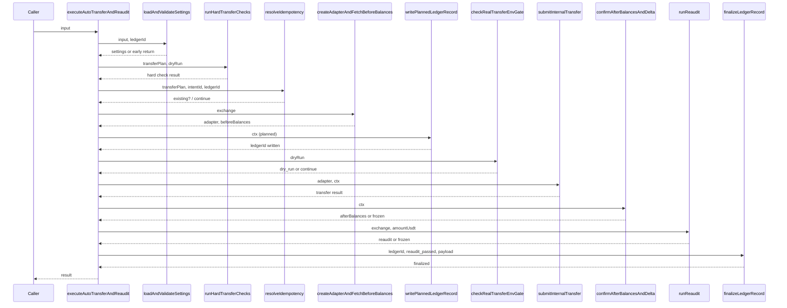
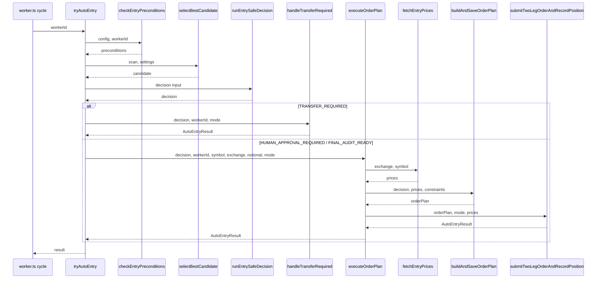
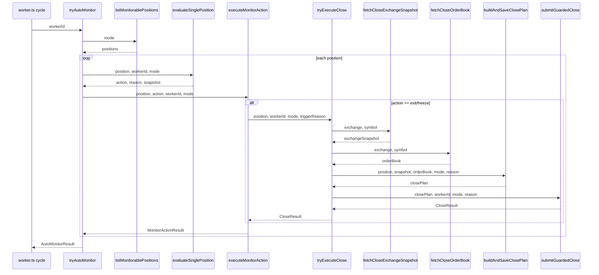

# 拆分超长函数方案设计

> 文档日期：2026-07-01  
> 适用范围：`lib/strategy-v121/execution/autoTransferExecutor.ts`、`lib/strategy-v121/worker/workerAutoExecution.ts`  
> 目标：将行数超过 80 行的函数按职责阶段拆分为可独立测试的子函数，并补充纯函数 helper。

---

## 1. 函数行数统计

| 文件 | 函数名 | 起始行 | 结束行 | 有效行数 | 是否 >80 行 |
|------|--------|--------|--------|----------|-------------|
| `execution/autoTransferExecutor.ts` | `executeAutoTransferAndReaudit` | 39 | 257 | 219 | ✅ 是 |
| `worker/workerAutoExecution.ts` | `tryAutoEntry` | 72 | 228 | 157 | ✅ 是 |
| `worker/workerAutoExecution.ts` | `executeOrderPlan` | 233 | 377 | 145 | ✅ 是 |
| `worker/workerAutoExecution.ts` | `tryAutoMonitor` | 395 | 527 | 133 | ✅ 是 |
| `worker/workerAutoExecution.ts` | `tryExecuteClose` | 534 | 648 | 115 | ✅ 是 |

> 注：任务目标文件中的 `lib/strategy-v121/services/finalAuditService.ts` 在项目中不存在（已通过 Glob 全项目搜索确认），本方案不对其进行分析。

---

## 2. 拆分总体原则

1. **一阶段一函数**：每个阶段只做一件事，阶段之间通过上下文对象传递状态。
2. **早返回由入口函数负责，阶段函数只返回结果**：避免子函数内部有过多 `return`。
3. **ledger / audit 写操作集中到入口函数或专用 writer**：避免每个子函数都依赖副作用。
4. **提取 pure helper**：无状态校验、数据转换、快照构造等尽量做成纯函数。
5. **与现有风格保持一致**：参考 `guardedOrderExecutor.ts`（Phase 1~6 + helper）和 `guardedCloseExecutor.ts`（ledger-before-submission、两腿顺序、验证后关闭）的拆分方式。

---

## 3. `autoTransferExecutor.ts` 拆分方案

### 3.1 当前阶段划分

`executeAutoTransferAndReaudit` 可划分为 11 个阶段：

```
[入口] -> 1.加载设置 -> 2.设置门控 -> 3.安全决策检查 -> 4.硬检查
      -> 5.幂等 key 生成与查重 -> 6.适配器创建 -> 7.划转前余额读取
      -> 8.写入 planned ledger -> 9.dry-run / env 门控分支
      -> 10.真实划转提交 -> 11.划转后余额读取与确认
      -> 12.余额变化方向校验 -> 13.重新资本预检 -> 14.重新最终审计
      -> 15.ledger 最终更新 -> [返回]
```

### 3.2 建议拆分后的子函数

| 阶段 | 建议子函数名 | 职责 | 是否 async | 输入 | 输出 |
|------|--------------|------|------------|------|------|
| 1-3 | `loadAndValidateSettings(input, ledgerId)` | 加载用户设置，校验 allowAutoTransfer、mode、maxAutoTransferUsdt、safeExecutionDecision | ✅ | `input`, `ledgerId` | `{ ok, blockers[], warnings[], settings }` |
| 4 | `runHardTransferChecks(transferPlan, dryRun)` | HTX/OKX/其他所、USDT、同账户校验 | ❌ | `transferPlan`, `dryRun` | `{ ok, status, blockers[] }` |
| 5 | `resolveIdempotency(transferPlan, intentId, ledgerId)` | 生成幂等 key，查询 ledger，决定是复用/阻断/继续 | ✅ | `transferPlan`, `intentId`, `ledgerId` | `{ action: "continue"\|"return_existing"\|"return_failed", existing?, status?, blockers? }` |
| 6-7 | `createAdapterAndFetchBeforeBalances(exchange)` | 创建 account adapter，获取划转前余额 | ✅ | `exchange` | `{ ok, adapter?, beforeBalances?, blockers? }` |
| 8 | `writePlannedLedgerRecord(ctx)` | 写入 planned/dry_run ledger 记录 | ✅ | 上下文 | `void` |
| 9 | `checkRealTransferEnvGate(dryRun)` | dry-run 返回、env 门控检查 | ❌ | `dryRun` | `{ shouldReturn, status?, blockers? }` |
| 10 | `submitInternalTransfer(adapter, ctx)` | 调用 adapter.transferInternal，处理失败/frozen | ✅ | `adapter`, 上下文 | `{ ok, transfer?, status?, blockers? }` |
| 11-12 | `confirmAfterBalancesAndDelta(ctx)` | 重试读取划转后余额，校验余额变化方向 | ✅ | 上下文 | `{ ok, afterBalances?, status?, blockers? }` |
| 13-14 | `runReaudit(exchange, amountUsdt)` | 重新跑 capitalPrecheck + finalPreExecutionAudit | ✅ | `exchange`, `amountUsdt` | `{ ok, reaudit?, blockers? }` |
| 15 | `finalizeLedgerRecord(ledgerId, status, payload)` | 更新 ledger 为最终状态 | ✅ | `ledgerId`, `status`, `payload` | `void` |

### 3.3 建议提取的 pure/helper 函数

| 函数名 | 职责 | 所在文件建议 |
|--------|------|--------------|
| `buildIdempotencyKey(input)` | 根据 exchange/from/to/amount/intentId 构建幂等 key | `autoTransferExecutor.ts` 底部或 `internalTransferHelpers.ts` |
| `toBinanceTransferType(from, to)` | 现有函数，保持纯函数，可抽出到 `exchange/internalTransferMapping.ts` | 新建或保留 |
| `computeBalanceDelta(before, after, account)` | 计算某账户 USDT free 变化量（当前 `findBalanceDelta` 已有） | 保留/重命名 |
| `isBalanceDirectionChanged(deltaFrom, deltaTo)` | 判断 from 账户减少且 to 账户增加 | `autoTransferExecutor.ts` 或 helper |
| `buildTransferLedgerPayload(request, response?, balanceDelta?, reaudit?)` | 构造 ledger rawJson 对象 | `autoTransferExecutor.ts` 或 ledger 层 |

### 3.4 调用流程图



---

## 4. `workerAutoExecution.ts` 拆分方案

### 4.1 `tryAutoEntry` 拆分

#### 当前阶段

```
[入口] -> 1.模式检查 -> 2.读取最新扫描 -> 3.检查已有持仓
      -> 4.加载设置 -> 5.候选筛选排序 -> 6.安全决策
      -> 7.状态分支处理（BLOCKED/FROZEN、TRANSFER_REQUIRED、HUMAN_APPROVAL_REQUIRED）
      -> 8.调用 executeOrderPlan -> [返回]
```

#### 拆分后子函数

| 阶段 | 子函数名 | 职责 | 是否 async | 输出 |
|------|----------|------|------------|------|
| 1-3 | `checkEntryPreconditions(config, workerId)` | 模式、扫描结果、持仓检查 | ✅ | `{ ok, skippedReason? }` |
| 4-5 | `selectBestCandidate(scan, settings)` | 加载设置，筛选 S/A 级、同所、非 HTX、非小币、funding 达标，取评分最高 | ✅ | `{ ok, candidate?, symbol?, exchange?, plannedNotional?, skipReason? }` |
| 6 | `runEntrySafeDecision(input)` | 调用 runSafeExecutionDecision | ✅ | `SafeExecutionDecision` |
| 7 | `handleTransferRequired(decision, workerId, mode)` | 调用 executeAutoTransferAndReaudit，划转后重跑安全决策 | ✅ | `AutoEntryResult` |
| 8 | `dispatchToOrderPlan(decision, workerId, symbol, exchange, plannedNotional, mode)` | 直接或划转后调用 executeOrderPlan | ✅ | `AutoEntryResult` |

入口 `tryAutoEntry` 只负责按顺序调用上述函数，并根据结果返回 `AutoEntryResult`。

### 4.2 `executeOrderPlan` 拆分

#### 当前阶段

```
[入口] -> 1.获取约束 -> 2.获取实时价格（binance/okx 分支）
      -> 3.构建 two-leg 订单计划 -> 4.保存计划 -> 5.确定 dryRun/confirm
      -> 6.执行 guarded order -> 7.处理 filled/dry_run/失败分支 -> [返回]
```

#### 拆分后子函数

| 阶段 | 子函数名 | 职责 | 是否 async | 输出 |
|------|----------|------|------------|------|
| 2 | `fetchEntryPrices(exchange, symbol, workerId)` | 根据交易所构造 public adapter，获取 spot bid1 / perp ask1 | ✅ | `{ ok, spotPrice, perpPrice, warnings[] }` |
| 3-4 | `buildAndSaveOrderPlan(decision, symbol, exchange, plannedNotional, prices, constraints)` | 调用 buildTwoLegOrderPlan 并保存，返回验证结果 | ✅ | `{ ok, orderPlan?, blockers? }` |
| 5-7 | `submitTwoLegOrderAndRecordPosition(orderPlan, workerId, mode, prices, symbol, exchange, plannedNotional, decision)` | 确定 dryRun/confirm，调用 executeGuardedTwoLegOrder，成功则写入 paperStore | ✅ | `AutoEntryResult` |

#### 建议提取的 pure helper

| 函数名 | 职责 |
|--------|------|
| `formatRawSymbolForExchange(symbol, exchange)` | 将 `BTC/USDT` 格式化为 `BTCUSDT`(binance) 或 `BTC-USDT`(okx) |
| `isEntryResultSuccessful(status)` | 判断 executeGuardedTwoLegOrder 的结果是否应视为成功 |
| `buildPaperExecutionFromFill(positionId, path, plan, prices, executionResult)` | 根据成交结果构造 PaperExecution |

### 4.3 `tryAutoMonitor` 拆分

#### 当前阶段

```
[入口] -> 1.模式检查 -> 2.查找可监控持仓 -> 3.遍历每个持仓
      -> 4.获取实时行情 -> 5.计算持仓时长 -> 6.获取 funding 信息
      -> 7.构造 PositionSnapshot -> 8.运行 monitorPosition
      -> 9.根据 action 执行平仓或 hold/reduce -> 10.汇总结果 -> [返回]
```

#### 拆分后子函数

| 阶段 | 子函数名 | 职责 | 是否 async | 输出 |
|------|----------|------|------------|------|
| 1-2 | `listMonitorablePositions(mode)` | 模式检查 + 查找 OPEN/MONITORING 持仓 | ❌ | `{ ok, positions[], skipReason? }` |
| 4-8（单个持仓） | `evaluateSinglePosition(position, workerId, mode)` | 获取价格、时长、funding，构造 PositionSnapshot，调用 monitorPosition，返回 action | ✅ | `{ action, reason, snapshot? }` |
| 9 | `executeMonitorAction(position, action, workerId, mode)` | 对 exit/freeze 调用 tryExecuteClose，其他直接 hold/reduce | ✅ | `MonitorActionResult` |

### 4.4 `tryExecuteClose` 拆分

#### 当前阶段

```
[入口] -> 1.获取交易所快照（balances/positions/openOrders） -> 2.获取实时盘口
      -> 3.构造 exchangeSnapshot / orderBook -> 4.获取约束 -> 5.确定 realCloseEnabled
      -> 6.构建 close plan -> 7.保存 close plan -> 8.确定 dryRun/confirm
      -> 9.执行 guarded close -> 10.处理 closed/prechecked/失败 -> [返回]
```

#### 拆分后子函数

| 阶段 | 子函数名 | 职责 | 是否 async | 输出 |
|------|----------|------|------------|------|
| 1 | `fetchCloseExchangeSnapshot(exchange, symbol)` | 创建 adapter，获取 balances/positions/openOrders，构造 ExchangeAccountSnapshot | ✅ | `{ ok, snapshot?, blockers? }` |
| 2-3 | `fetchCloseOrderBook(exchange, symbol)` | 获取 spot bid1 / perp ask1 / markPrice，构造 orderBook | ✅ | `{ ok, orderBook?, warnings? }` |
| 4-7 | `buildAndSaveClosePlan(position, exchangeSnapshot, orderBook, mode, triggerReason)` | 获取约束，确定 realCloseEnabled，构建并保存 close plan | ✅ | `{ ok, closePlan?, blockers? }` |
| 8-10 | `submitGuardedClose(closePlan, workerId, mode, triggerReason, symbol)` | 确定 dryRun/confirm，调用 executeGuardedClose，返回 CloseResult | ✅ | `CloseResult` |

#### 建议提取的 pure helper

| 函数名 | 职责 |
|--------|------|
| `extractSpotBalance(balances, baseAsset)` | 从余额数组中找到对应 base asset |
| `extractPerpShortPosition(positions, symbol)` | 从持仓数组中找到对应 symbol 的 perp_short |
| `isRealCloseEnabled(mode, env)` | 根据 mode 和 env 判断是否允许真实平仓 |

### 4.5 workerAutoExecution 整体调用流程





---

## 5. 文件变更清单

| 文件 | 变更类型 | 变更内容 |
|------|----------|----------|
| `lib/strategy-v121/execution/autoTransferExecutor.ts` | 修改 | 拆分 `executeAutoTransferAndReaudit` 为多个阶段函数；提取纯函数 helper |
| `lib/strategy-v121/worker/workerAutoExecution.ts` | 修改 | 拆分 `tryAutoEntry`、`executeOrderPlan`、`tryAutoMonitor`、`tryExecuteClose`；提取 helper |
| `lib/strategy-v121/execution/autoTransferExecutor.test.ts` | 修改 | 为新增子函数补充单测；保持现有端到端用例不变 |
| `lib/strategy-v121/worker/workerAutoExecution.test.ts` | 新增/修改 | 新增单元测试覆盖各阶段函数 |
| `lib/strategy-v121/execution/internalTransferHelpers.ts`（可选） | 新增 | 放置 `buildIdempotencyKey`、`toBinanceTransferType`、`isBalanceDirectionChanged` 等 |
| `lib/strategy-v121/worker/workerExecutionHelpers.ts`（可选） | 新增 | 放置 `formatRawSymbolForExchange`、`extractSpotBalance`、`extractPerpShortPosition` 等 |

> 注：`lib/strategy-v121/services/finalAuditService.ts` 未找到，无需变更。

---

## 6. 实现顺序

建议按以下顺序实施，每个步骤完成后运行现有测试：

1. **P0：先拆分 `autoTransferExecutor.ts`**
   - 影响范围相对独立，已有完整测试覆盖，风险最低。
   - 先提取 helper，再按阶段拆分，保持接口签名不变。
2. **P0：拆分 `tryExecuteClose`**
   - 逻辑与 `guardedCloseExecutor` 对称，拆分模式成熟。
   - 拆分后可显著提升平仓路径的可测试性。
3. **P1：拆分 `executeOrderPlan`**
   - 依赖 public adapter 价格获取，拆分后便于 mock。
   - 注意保持 SHADOW/MAINNET_TINY 模式行为一致。
4. **P1：拆分 `tryAutoMonitor`**
   - 主要重构循环体，将单持仓评估逻辑抽出。
   - 拆分后可为每个持仓单独写单元测试。
5. **P1：拆分 `tryAutoEntry`**
   - 入口函数，依赖前述子函数，放在较后实施。
   - 拆分后确保安全决策状态分支清晰。

---

## 7. 测试补全建议

### 7.1 `autoTransferExecutor.test.ts` 新增用例

| 测试目标 | 覆盖场景 |
|----------|----------|
| `loadAndValidateSettings` | allowAutoTransfer=false、mode=disabled/suggest_only、amount > max、safeExecutionDecision 不通过 |
| `runHardTransferChecks` | HTX、非 binance/okx 真实划转、非 USDT、同账户 |
| `resolveIdempotency` | 已存在 submitted/balance_confirmed/reaudit_passed、已存在 failed/frozen、不存在 |
| `createAdapterAndFetchBeforeBalances` | adapter 创建失败、余额读取失败 |
| `submitInternalTransfer` | transfer.ok=false、status=frozen、正常 submitted |
| `confirmAfterBalancesAndDelta` | 余额读取重试、余额未变化 |
| `runReaudit` | capitalPrecheck 异常、finalAudit 异常、正常通过 |

### 7.2 `workerAutoExecution.test.ts` 新增用例

| 目标函数 | 覆盖场景 |
|----------|----------|
| `checkEntryPreconditions` | READ_ONLY/PAPER 模式、无扫描结果、已有持仓 |
| `selectBestCandidate` | 无合格候选、S/A 级筛选、HTX 过滤、小币过滤、funding 不达标 |
| `handleTransferRequired` | 划转成功+重审计通过、划转失败、重审计仍 blocked |
| `fetchEntryPrices` | binance/okx 价格获取、获取失败使用回退值 |
| `buildAndSaveOrderPlan` | 计划验证失败、验证成功 |
| `submitTwoLegOrderAndRecordPosition` | filled 创建 paper、dry_run、执行失败 |
| `listMonitorablePositions` | READ_ONLY 模式、无可监控持仓 |
| `evaluateSinglePosition` | exit/freeze/hold/reduce 各分支 |
| `executeMonitorAction` | exit/freeze 调用 tryExecuteClose、hold/reduce 直接返回 |
| `fetchCloseExchangeSnapshot` | adapter 查询失败、正常返回 |
| `fetchCloseOrderBook` | 价格获取失败、正常返回 |
| `buildAndSaveClosePlan` | 计划验证失败、验证成功 |
| `submitGuardedClose` | closed/prechecked/失败分支 |

---

## 8. 风险提示

| 风险点 | 影响 | 缓解措施 |
|--------|------|----------|
| 拆分过程中改动 ledger 写入位置，可能导致 ledger 状态字段不一致 | 高 | 保持 `createInternalTransferRecord`/`updateInternalTransferRecord` 调用参数不变；拆分时仅将调用封装到 `writePlannedLedgerRecord`/`finalizeLedgerRecord` |
| `executeAutoTransferAndReaudit` 返回的 `ledgerId` 在幂等命中时可能为 existing id，拆分后需保持 | 中 | 在 `resolveIdempotency` 阶段直接返回 existing id，不生成新 ledgerId |
| `workerAutoExecution` 中多处使用 `any` 类型（如 `balances as any[]`），拆分后类型暴露 | 中 | 拆分时可顺带补充类型，但建议与本次重构解耦，避免引入额外风险 |
| 价格获取失败后的回退值（spotPrice=60000）依赖硬编码，拆分后行为需保持一致 | 低 | 在 `fetchEntryPrices` 中保留回退值逻辑，并在测试中覆盖 |
| `tryAutoMonitor` 循环内异常捕获当前会吞掉错误，拆分后需确保每个持仓失败不影响其他持仓 | 中 | `evaluateSinglePosition`/`executeMonitorAction` 内部各自 try-catch，入口循环不再嵌套大 try-catch |
| 自动平仓和平仓执行器已较成熟，拆分 `tryExecuteClose` 时需避免与 `guardedCloseExecutor` 重复造轮子 | 低 | 将交易所快照、盘口获取抽出为独立 helper，但 `guardedCloseExecutor` 本身不做改动 |

---

## 9. 设计假设

1. 拆分后的入口函数保持原有公开 API 签名不变，外部调用方（如 `worker.ts`）无需修改。
2. 本次方案只涉及代码结构拆分，不修改业务逻辑、不调整阈值、不新增交易所支持。
3. `lib/strategy-v121/services/finalAuditService.ts` 不存在，因此未纳入拆分范围；`autoTransferExecutor` 中调用的 `runFinalPreExecutionAudit` 来自 `../mainnetTiny/finalPreExecutionAudit`，不在本次拆分之列。
4. 参考现有 `guardedOrderExecutor.ts` 的 Phase 拆分风格，新子函数使用 `validateXxx` / `submitXxx` / `queryXxx` 等命名。
5. 所有提取的 helper 函数均应为纯函数或接近纯函数，便于单元测试。
