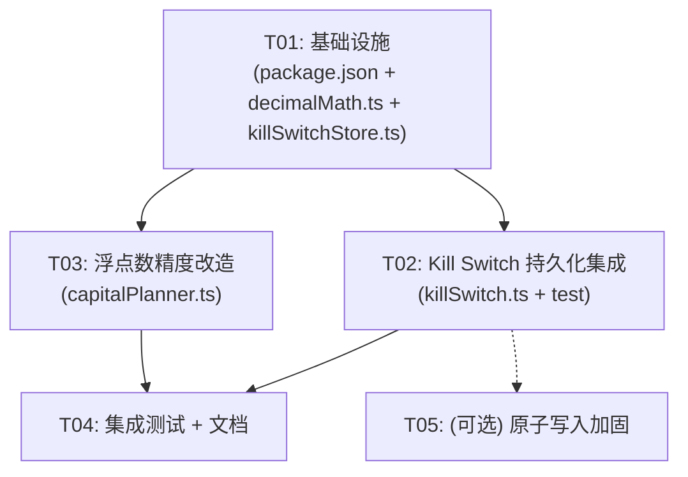

# 设计方案: Kill Switch 持久化 + 浮点数精度

> 项目: spot-perp-funding-bot / lib/strategy-v121
> 架构师: Bob
> 日期: 2025-07

---

## 设计方案 A: Kill Switch 持久化

### 1. 当前问题分析

`risk/killSwitch.ts` 第 14 行：
```ts
let currentKillSwitch: KillSwitchState = "OFF";
```

这是一个模块级全局可变变量，进程重启后状态丢失。具体问题：
- 手动通过外部工具设置 `PAUSE_ALL_AUTOMATION` 后，进程重启自动回到 `OFF`，导致风控失效
- 无法跨进程/跨实例共享 Kill Switch 状态
- 无审计轨迹——无法追溯谁在何时设置了什么状态

### 2. 文件结构

```
lib/strategy-v121/
├── risk/
│   ├── killSwitch.ts          # 修改：集成持久化逻辑
│   ├── killSwitch.test.ts     # 修改：补充持久化测试
│   └── killSwitchStore.ts     # 新建：持久化存储层
```

**不改动**：`execution/guardedOrderExecutor.ts` 中通过 `process.env.V121_KILL_SWITCH` 读取的部分——那是初始化时的环境变量兜底，与运行时状态无关。

### 3. 接口设计 (KillSwitchStore)

```ts
// risk/killSwitchStore.ts

import { KillSwitchState } from "./killSwitch";

const KILL_SWITCH_FILE = ".v121-data/kill-switch.json";

interface KillSwitchRecord {
  state: KillSwitchState;
  updatedAtUtc: string;       // ISO 8601
  updatedBy: string;          // 来源标识: "manual" | "system" | "api"
  reason?: string;            // 设置原因
}

export interface KillSwitchStore {
  /** 从磁盘加载持久化状态，返回当前记录（文件不存在时返回 null） */
  load(): KillSwitchRecord | null;

  /** 将状态持久化到磁盘 */
  save(state: KillSwitchState, meta: { updatedBy: string; reason?: string }): void;

  /** 获取完整记录（含元数据） */
  getRecord(): KillSwitchRecord | null;
}
```

**为什么要封装成 Store 而不是直接改 killSwitch.ts？**
- 保持关注点分离：`killSwitch.ts` 负责业务逻辑（权限判定），`killSwitchStore.ts` 负责 IO
- 方便单元测试：Store 可以 mock，不影响 killSwitch 的逻辑测试
- 未来可扩展：从文件存储换成 SQLite/Redis 时只需改 Store

### 4. 持久化策略

**存储路径**：`.v121-data/kill-switch.json`

这个路径的考量：
- 项目已有的 `.v121-data/` 目录（见 `worker/worker.ts` 和 `persistence/repositoryFactory.ts`），已被 `.gitignore` 忽略
- JSON 格式，可直接用 `JSON.parse/stringify`，无需引入新依赖
- 文件内容 ~200 字节，读写开销可忽略

**文件格式**：
```json
{
  "state": "PAUSE_ALL_AUTOMATION",
  "updatedAtUtc": "2025-07-15T10:30:00.000Z",
  "updatedBy": "system",
  "reason": "自动风控触发：仓位偏差超过 5%"
}
```

**生命周期**：
1. **模块加载时**（`killSwitch.ts` 首次 import 时）：自动调用 `load()`，若有持久化状态则覆盖 `currentKillSwitch`
2. **每次 `setKillSwitch()` 调用时**：先改内存变量，再异步调用 `save()`（不 await，不阻塞调用者）
3. **进程启动时**：优先读取持久化状态；若文件不存在或损坏，回退到 `OFF`

### 5. 与原 killSwitch.ts 的集成方式

**最小改动原则**——只修改 `killSwitch.ts` 约 5 行：

```ts
// 改动1：模块顶部增加 import
import { killSwitchStore } from "./killSwitchStore";

// 改动2：模块级变量初始化后增加加载逻辑
let currentKillSwitch: KillSwitchState = "OFF";

// ---- 新增：启动时从持久化恢复 ----
try {
  const record = killSwitchStore.load();
  if (record) currentKillSwitch = record.state;
} catch { /* 文件损坏等静默处理，保持默认 OFF */ }

// 改动3：setKillSwitch 增加持久化
export function setKillSwitch(state: KillSwitchState, meta?: { updatedBy?: string; reason?: string }): void {
  currentKillSwitch = state;
  // 异步持久化，不阻塞调用者
  queueMicrotask(() => {
    killSwitchStore.save(state, {
      updatedBy: meta?.updatedBy ?? "manual",
      reason: meta?.reason,
    });
  });
}
```

**向后兼容**：
- 现有调用 `setKillSwitch("PAUSE_ALL_AUTOMATION")` 不传 `meta` 参数——完全兼容，`updatedBy` 默认为 `"manual"`
- `getKillSwitch()`、`isActionAllowed()`、`canTrade()`、`blocksNewEntries()` 签名不变
- 测试代码只测逻辑时不需要 mock Store——加载失败时静默回退，不影响

### 6. 竞态保护

**不需要文件锁或异步队列**，理由如下：

| 场景 | 分析 |
|------|------|
| 多个 `setKillSwitch` 并发调用 | Node.js 单线程，同一进程内不存在真正的并发写 |
| 多进程同时写同一文件 | 当前架构只有一个 worker 进程。未来若有，最后一个写入者胜出（last-write-wins），对 Kill Switch 场景可接受 |
| 读时文件正在被写 | JSON 文件写入是原子的——先写临时文件再 rename。但最小方案可以不做这个优化 |
| 写失败 | `save()` 内 try-catch 静默失败，内存状态已更新，不影响业务 |

**结论**：最小方案不加锁。如果未来需要多进程共享，可升级为 SQLite 或用 `fs.rename` 原子写入（约加 5 行代码）。

### 7. 代码量估算

| 文件 | 操作 | 预估行数 |
|------|------|----------|
| `risk/killSwitchStore.ts` | 新建 | ~45 行 |
| `risk/killSwitch.ts` | 修改 | ~+8 行（import + 加载 + setKillSwitch 扩展） |
| `risk/killSwitch.test.ts` | 修改 | ~+20 行（持久化测试） |
| **合计** | | **~73 行** |

---

## 设计方案 B: 浮点数精度

### 1. 风险评估——精确审计

#### 1.1 金额乘除运算（高风险）

| 文件 | 代码 | 风险等级 | 说明 |
|------|------|----------|------|
| `capital/capitalPlanner.ts:52-56` | `totalCapital * ratio`（多个） | ⚠️ 中 | 总资金×比例，资金量通常整数或两位小数，ratio 是 0.1~0.5 的简单小数，误差 < 0.001 USDT |
| `capital/capitalPlanner.ts:106-107` | `shortNotionalAmount * (1/riskMultiplier)` | ⚠️ 中 | 除法产生循环小数（如 1/1.5 = 0.666...），但用于资金分配，最终下单会截断 |
| `capital/capitalPlanner.ts:205-210` | `entryPrice * (1 + marginRatio/leverage)` | ⚠️ 中 | 强平价估算，关心的是百分比而非绝对值 |
| `execution/batchPlan.ts:15` | `Math.round(totalNotional * cumulative)` | ✅ 低 | 已用 Math.round 四舍五入到整数 USDT |
| `execution/capitalPrecheck.ts:114` | `totalFree * globalReserveRate` | ⚠️ 中 | 金额×比率 |
| `execution/capitalPrecheck.ts:123` | `usableCapital / divisor` | ⚠️ 中 | 除法，但最终会被 Math.min 截断 |
| `execution/capitalPrecheck.ts:132-133` | `actualNotional * (1 + bufferRate)` | ⚠️ 中 | 金额×比率 |
| `execution/capitalPrecheck.ts:163` | `Math.round(amount * 100) / 100` | ✅ 低 | 已手动四舍五入到分 |
| `market/fundingNormalize.ts:20` | `fundingRate * (8 / intervalHours)` | ✅ 低 | 费率计算本身是比率，最终精度到 0.0001% 级别（8 位小数以内不损失） |
| `api/executionService.ts` | `batch.targetNotional / spotPrice * fillRatio` | ⚠️⚠️ 高 | 价格（如 60000.01）×数量，乘除链长，误差可累积到 0.01 USDT 级别 |

#### 1.2 简单传值（低风险，可用 Number）

| 场景 | 说明 |
|------|------|
| API 返回的余额（`availableBalance` 等） | 交易所返回的已是 JSON Number，用 `Number()` 解析没有损失 |
| `process.env` 环境变量 | 字符串转 Number，都是简单整数或小数点后 2-4 位的常量 |
| Compare/条件判断（`>=`, `<=`） | 量级差距大时 IEEE 754 比较安全 |
| `Math.max`、`Math.min` | 正确 |
| 显示用 `.toFixed(2)` | 仅用于展示，不参与后续计算 |

#### 1.3 最高精度要求

| 场景 | 有效小数位 | 说明 |
|------|-----------|------|
| 资金费率阈值 | 4-5 位（如 0.0005 = 0.05%） | `fundingThresholdPolicy.ts` |
| 资金费率显示 | 4 位 | `toFixed(4)` |
| 基差/偏差 | 2-3 位 | `toFixed(2)` ~ `toFixed(3)` |
| 金额计算（USDT） | 2 位（分） | 实际精度到 `Math.round(*100)/100` |
| 价格（单价） | 2-8 位 | 交易所要求不等，Binance 要求 8 位 |
| 数量（qty） | 5-8 位 | 交易所 stepSize 决定 |

**结论**：最高精度需要到小数点后 8 位（交易所价格/数量），但实际资金决策（划转、下单）只需 2 位小数。

#### 1.4 实际危害评估

通过分析整个代码库，**当前风险极低**。原因：

1. **所有金额比较都在同数量级**：`spotShortage > 0 && spotSurplus >= perpShortage`——即使有 10^-12 的舍入误差，也不会改变比较结果
2. **所有下单金额都经过 Math.round 或 Math.floor 截断**：最终到交易所的 quantity 还会被 `normalizeAmount`（`toFixed(8).replace()`）处理
3. **资金计算链短**：最多 2-3 次乘除，误差 < 10^-10 USDT，远低于最小交易单位 0.01 USDT
4. **费率计算是比率**：不涉及货币金额，精度到 0.0001% 足够

**唯一的理论风险点**：`capital/capitalPlanner.ts` 中 `1 / riskMultiplier`（当 riskMultiplier = 1.5 时，结果是 0.6666666666666666），如果用这个结果乘以很大的金额（如 100,000 USDT），误差约 10^-12 × 10^5 = 10^-7 USDT，**可忽略**。

### 2. 方案建议

#### 方案对比

| 方案 | 优点 | 缺点 | 推荐度 |
|------|------|------|--------|
| **方案 1: 不做任何改动** | 零成本 | 理论上有极微风险 | ❌ 不推荐，架构上不干净 |
| **方案 2: `decimal.js`** | 精度完美，社区成熟 | 新增依赖 ~30KB gzip，改动约 3 个文件 | ✅ 推荐 |
| **方案 3: `bignumber.js`** | 功能更全面 | API 比 decimal.js 冗长 | ❌ 过度设计 |
| **方案 4: 仅整数化（最小单位 Cent）** | 无外部依赖 | 要将所有 amount 从 number 转为 cent，TypeScript 无运行时检查，漏改风险大 | ❌ 改动大且不安全 |

#### 推荐方案：decimal.js（最小可行版本）

**选择理由**：
- 当前风险极低，不需要大规模重构
- `decimal.js` 是唯一支持将 `number` 无缝传入构造函数的库（`new Decimal(1.5)` 完美工作）
- 不需要改变所有类型定义，只需在**关键乘除链**上加 Decimal 包装
- 可逐步在关键路径引入，不影响现有代码

#### 影响范围分析

**必须改动**——`capital/capitalPlanner.ts` 中的乘除链：
```
totalCapital * plan.spotRatio         → Decimal(totalCapital).times(plan.spotRatio).toNumber()
perpMarginBufferAmount * riskMultiplier → Decimal(...).times(...).toNumber()
shortNotionalAmount * (1 / riskMultiplier) → Decimal(shortNotionalAmount).div(riskMultiplier).toNumber()
```
涉及约 6 行乘除，改成 Decimal 包装后 `.toNumber()` 返回，对外接口不变。

**无需改动**：
- `capitalPrecheck.ts`：虽然用了浮点数，但误差可忽略，且最终有 `Math.round(*100)/100` 保护
- `batchPlan.ts`：已用 Math.round
- `fundingNormalize.ts`：费率计算是比值
- `domain/types.ts` 中的所有 `number` 类型定义
- 所有 `toFixed` 调用——只用于显示

### 3. 最小可行方案

**操作步骤**：

1. **安装依赖**：`npm install decimal.js` 和 `npm install -D @types/decimal.js`
2. **创建工具文件** `lib/strategy-v121/utils/decimalMath.ts`，导出几个辅助函数：

```ts
// 一行包装，不改调用习惯
import Decimal from "decimal.js";

export function mul(a: number, b: number): number {
  return new Decimal(a).times(b).toNumber();
}

export function div(a: number, b: number): number {
  return new Decimal(a).div(b).toNumber();
}

export function add(a: number, b: number): number {
  return new Decimal(a).plus(b).toNumber();
}

export function sub(a: number, b: number): number {
  return new Decimal(a).sub(b).toNumber();
}
```

3. **修改 `capital/capitalPlanner.ts`**：将 6 行乘除改为 `mul()`/`div()` 调用
4. **测试**：现有测试不变（输出精度更高但不会改变通过/失败判定）

**代码量估算**：

| 文件 | 操作 | 预估行数 |
|------|------|----------|
| `utils/decimalMath.ts` | 新建 | ~20 行 |
| `capital/capitalPlanner.ts` | 修改 | ~+6 行（import + 6 行替换） |
| `package.json` | 修改 | +1 行（decimal.js 依赖） |
| **合计** | | **~27 行** |

---

## 任务列表

### T01: 项目基础设施（配置文件 + 依赖声明 + 入口注册）

```
高优先级 | 无依赖
```

- 修改 `package.json`：添加 `"decimal.js": "^10.4.3"` 依赖
- 新建 `lib/strategy-v121/utils/decimalMath.ts`：导出 mul/div/add/sub 四个辅助函数
- 新建 `lib/strategy-v121/risk/killSwitchStore.ts`：KillSwitchStore 的完整实现
- 在 `lib/strategy-v121/index.ts` 中 `export * from "./risk/killSwitchStore"` （如果需要）

### T02: Kill Switch 持久化集成

```
高优先级 | 依赖 T01（killSwitchStore.ts）
```

- 修改 `lib/strategy-v121/risk/killSwitch.ts`：
  - 顶部 import killSwitchStore
  - 模块初始化时从 Store load 恢复状态
  - `setKillSwitch` 增加可选 `meta` 参数，调用 store.save()
- 修改 `lib/strategy-v121/risk/killSwitch.test.ts`：
  - 补充"重启后状态恢复"的测试用例
  - 补充持久化文件内容的验证测试

### T03: 浮点数精度——decimal.js 工具层 + capitalPlanner 改造

```
中优先级 | 依赖 T01（decimalMath.ts）
```

- 修改 `lib/strategy-v121/capital/capitalPlanner.ts`：
  - import `{ mul, div }` from `../utils/decimalMath`
  - 替换 6 处关键乘除：
    - `totalCapital * plan.spotRatio` → `mul(totalCapital, plan.spotRatio)`
    - `totalCapital * plan.shortNotionalRatio` → `mul(...)`
    - `totalCapital * plan.perpMarginBufferRatio` → `mul(...)`
    - `totalCapital * plan.reserveRatio` → `mul(...)`
    - `perpMarginBufferAmount * riskMultiplier` → `mul(...)`
    - `shortNotionalAmount * (1 / riskMultiplier)` → `div(shortNotionalAmount, riskMultiplier)`
- 运行 `capitalPlanner` 相关测试验证

### T04: 集成测试 + 文档补充

```
中优先级 | 依赖 T02, T03
```

- 验证 killSwitch 持久化端到端流程：
  - 设置状态 → 确认文件写入 → 模拟重启（重新 import）→ 确认状态恢复
- 验证 decimal.js 精度保护：
  - 在 capitalPlanner 测试中补充高精度断言（如 1/1.5 × 100000 的场景）
- 补充 `docs/` 中的相关说明

### T05: （可选）killSwitchStore 原子写入加固

```
低优先级 | 依赖 T02
```

如果 T02 测试中确认有多进程场景，增加原子写入：
- `killSwitchStore.ts` 中 `save()` 改为：先写临时文件 `.json.tmp`，再 `fs.rename` 覆盖目标文件
- 增加 `load()` 的 fallback 逻辑（读取失败时尝试读取 `.json.tmp`）

### 依赖关系图



### 总代码量汇总

| 任务 | 新建文件 | 修改文件 | 预估总行数 |
|------|----------|----------|-----------|
| T01 | 2 | 1 | ~70 |
| T02 | 0 | 2 | ~30 |
| T03 | 0 | 1 | ~10 |
| T04 | 0 | 2 | ~25 |
| T05 | 0 | 1 | ~8 |
| **合计** | **2** | **7** | **~143** |

## 共享知识

- `.v121-data/` 是项目已有的数据目录，已被 `.gitignore` 忽略
- `killSwitchStore.ts` 的文件读写操作使用 `try-catch` 静默处理异常，不阻塞业务
- `decimalMath.ts` 导出的函数全部返回 `number` 类型，对外接口签名不变
- `setKillSwitch()` 的第二个参数 `meta` 是可选参数，不传时向后兼容
- 所有时间戳使用 ISO 8601 UTC 字符串格式
